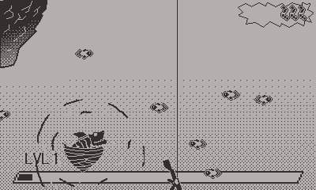

Extreme Auto Fishing is an vampire-survivor-like for the Playdate system. I started work on it back in ...oof... [February 2023](https://mastodon.gamedev.place/@cxsquared/109825085339456821). It's come a long long way since then though I'm still not fully happy with where it is currently. The core game play is there but I need a stronger loop and progression. I figured writing about it might inspire me to work on it some more.

## How it started

<video width="320" height="240" controls>
  <source src="/images/extreme-auto-fishing-dev-log/first_gameplay.mp4" type="video/mp4">
</video>

After the [2023 Global Game Jam](/blog/global-game-jam-2023-postmortem/) I decided to try and make a full blown Playdate game. My GGJ 2023 game was a Playdate game and I had created a [small little game](/games/locksmith/) for a different game jam so I was decently familiar with the system at this point. The idea was simple: I love a good fishing mini-game and I really liked Vampire Survivor. So why not combine the two things. The initial idea was instead of "bait" you had a gun and the fish attacked you. As you can see in the video above, the core bit of it was in place pretty quickly. It's been almost 2 years at this point and a lot of that hasn't really changed.

## Tech

I'm writing everything in Lua. I heavily debated using C for performance reasons (heck I even started rewriting everything at least once). Performance is still an issue but I've managed to get things to run okay enough (30 fps... ish). I used [Noble](https://noblerobot.com/nobleengine) for scene management and [tiny-ecs](https://github.com/bakpakin/tiny-ecs) for a pretty basic ECS system. I'm a huge fan of thinking in systems rather than classes when it comes to programming games so this worked out really well for me.

## Game play

Originally I wanted to emulate the progression of the upgradable flash game. Something like [Learn to fly](https://www.newgrounds.com/portal/view/495715) where the game play involves gaining a resource and that resource always you to get farther in the 1 level of the game. I built out some UIs and systems for this and it worked. But I wasn't thrilled with it. I eventually pivioted into a more Binding of Isaac style run with upgrades system. Over all this felt a lot better. The one piece I'm still missing is a resource collection bit. The current plan is after you die or finish a run you then have to real in all the gold you've picked up along the way. Then you can use that gold to spin a gatcha machine that will unlock new things and potentially give upgrades to your next run.

That's where I am today. I really need to get some audio into the game and get a demo out into the world. Hopefully this time next year I'll be posting about how I've actually finished it.

