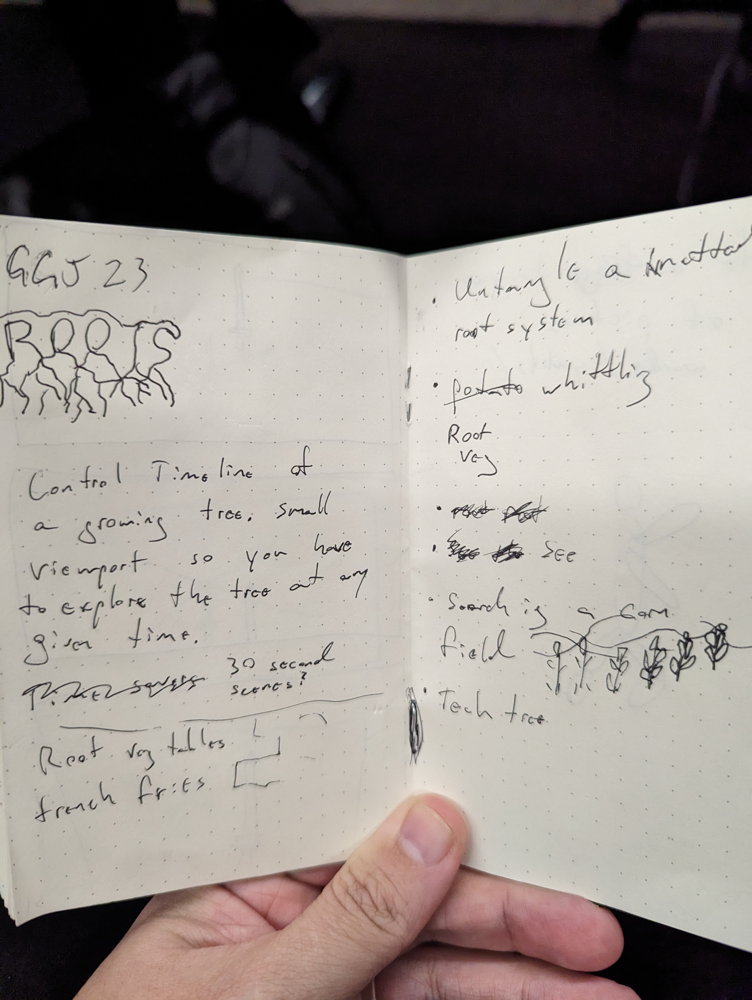
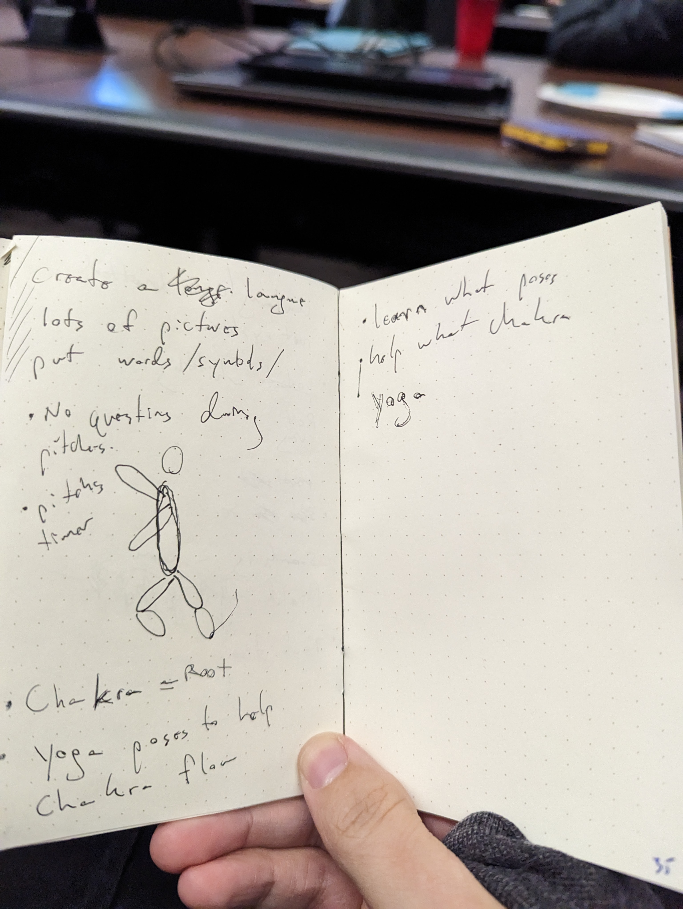
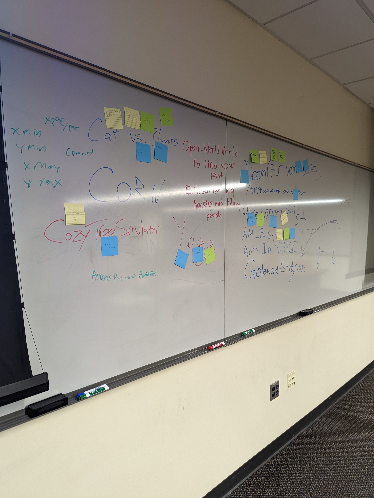
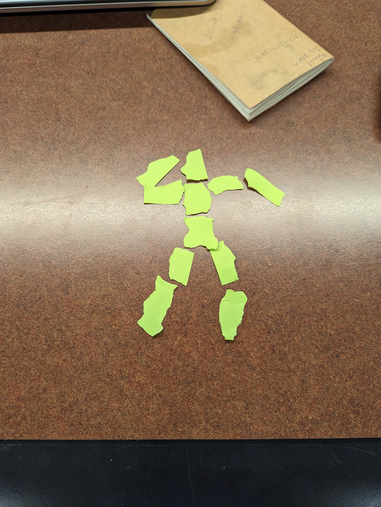
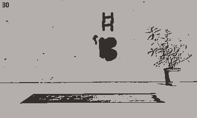
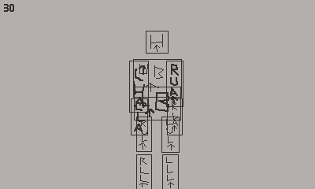
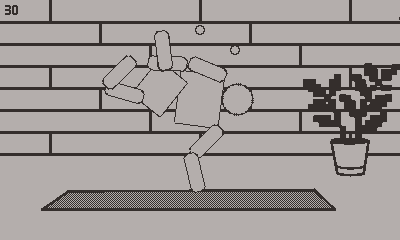
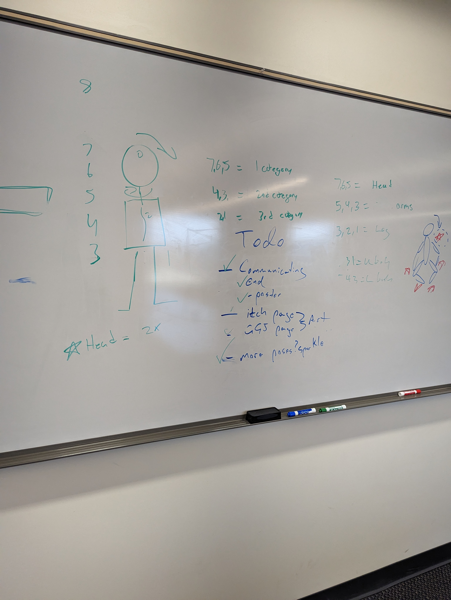
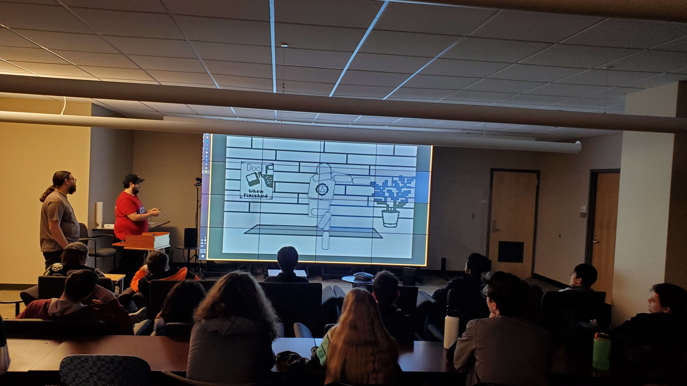

Disclaimer: I don't think this will be "educational" in really anyway. I do appreciate if you do decide to stick around and read my ramblings. Hopefully it can at least inspire some movement inside your brain for future projects.

Holly crap it's been 9 years since I did my first Global Game Jam! After all those years I feel like this was one of my most successful games yet. For those who don't know, Global Game Jam is an event that takes place over 28 hours (typically on the weekend) where teams/individuals make a game from scratch. Let's look back at how I got here and why I'm happy with how this years Global Game Jam turned out.

Before I start if you want to check out the game feel free to go download it and play it on either your own [Playdate](https://play.date/) or on the [Playdate Simulator](https://play.date/dev/). You can download the game over at <https://cxsquared.itch.io/yoga-therapy>.

## Planning

Typical of every Global Game Jam I've done the first thing we do is learn the theme. This year's theme was Roots. After the theme reveal we spend the next 30 minutes thinking up ideas. I quite liked the theme this year so it wasn't too hard to start jotting down ideas. This year I also convinced 2 of my friends to tag along. This meant during brainstorming we were able to bounce idea's off of each other. We collectively came up with the idea of making a funny yoga posing game because Chakra is the root of the body. One of my friends apparently had a game about controlling the growth of roots that they'd been working on for a few days. Obviously tree growing really fits the theme of roots and I was sold on the idea. Ultimately the game would have been about reviving a dead tree by guiding their roots and placing new leaves. As the tree grew back the environment around it would become greener and more animals would have been seen.

After brain storming, the group of about 40 of us took turns pitching game ideas. Me and my friends pitched both the yoga game and cozy tree game with the intention of just working on the cozy tree game. Yet somewhere between pitching the games and the end of all the pitches happening we had landed on doing the yoga game. What really turned the tides for our minds was the revelation that we could just rotate the person's joints and not include any real physics in the game. This made the game sound pretty easy to create and it would work perfectly on the [Playdate](https://play.date/) (spoilers: it was pretty easy).

## Day 1

After pitches, we settled on making the yoga game for the Playdate. Along with me and my two friends (who are all primarily programmer), we also picked up a UX designer who was a student at our jam site. The first thing we did was start paper prototyping. I'll admit I've never really paper prototyped but this case just screamed for it. We took some post-it notes, ripped them up into little body parts, and started experimenting with how it felt to move them.

The movement from the paper prototyping actually felt pretty good. So the next step was to just get making games. On the first day, after all is said and done, we only have a few hours to really work on our game. The first priority was getting that core movement mechanic into the game. Two of us started working on art assets and general design, one of us started working on the core of the code base (drawing stuff and what not), and I started working on the core mechanic code.

My first thought was how do I keep the limbs in the right position as things rotate. I figured I'd use some kind of recursion to grab the X,Y of ever limb. This was for sure the right path to start but I kinda got stuck thinking how do I anchor the X,Y of a child limb (say arm) to the parent (say body). This was a real struggle in my brain. Eventually I had the idea that since we are just rotating things let's treat everything as a circle. Then each child just says where they want to be on that circle. Treating things as circles rather than squares simplified the problem a lot for me. By the end of the first day I managed to get a small portion of this working. Having the core mechanic code working by the end of day 1 felt really good and gave me a lot of hope going into the rest of the weekend.

## Day 2

The first goal of the second day was to get the full body movement into the game. Luckily my code actually helped up from the first day and the process of creating the full body was just adding more limbs. By noon of the second day we had the core part of our game done. We through it on the Playdate, made sure the performance was okay (dynamic rotations on the Playdate can be pretty costly so we weren't sure how well the Playdate would handle it), and started doing some play tests with people at the jam site. To our surprise people really enjoyed the game so far and had a great time just moving the person around. The biggest feedback we got was the selecting body parts was unintuitive. For our first iteration we just looped through body part selection using left and right. So our next step was to work on joint selection and getting more final art into the game.

While another dev worked on joint selection I started implementing some art that our other devs had started creating. It took some trial and error on the sizing but eventually we had a full body and things were starting to look good.

Next up was scoring. Scoring was easily the most time consuming and thought about part of this project. I pushed heavily for not having any "predefined" pose goal. I wanted the players to explore and discover what ever weird scoring system we would end up coming up with. After much deliberation we settled on placing hidden points throughout the screen that were tied to certain body parts. At one point in time we also talked about having the 7 chakra also tied to the hidden points in space so the system was built with this in mind. Initially the idea was to show a graph at the end of each pose that represented the final scores for each of the 7 chakra. Most of the day was spent thinking about and tweaking this system.

At some point after dinner we kind of had an epiphany. With all our play tests the main thing people loved about the game was just moving the person around. We wanted to embody the feeling of yoga and zen. So we scrapped the points system in favor of a time system. We set an arbitrary time in the background and gave the player a score of 1 to 5 based on how long they spent just messing around with their pose. However we didn't want to completely leave the player without any feedback. We decided to use the hidden points in space to generate some fun sparkles. If a player put a body part in the right place they'd get some random shiny sprites showing up and going away. This let the player feel like there was something happening which I think added a lot to the game.

By the end of the day we had the full game loop more or less in place. This is an ideal position to be in for any game jam allowing us to spend the last day polishing up things. This extra polish time let us really refine the experience of our game.

## The Final Day

On the last day we created a little todo list which included some final polish, setting up the sites we need to upload the game to, and potentially some little easter eggs. Even thinking about little things like easter eggs was a huge success for us. This was by far the least stressful game jam I've ever done.

We did some more play testing and tiny tweaking here and there. Things like better communicating the actions the player could take, improving some audio things like chime feedback for the end of the game, and overall just polishing up little packaging things with the Playdate (like custom wrapping paper for when you first load it on to your Playdate). I think one of the most satisfying last day task we took on was our UX designer customizing our [Itch.io](https://cxsquared.itch.io/yoga-therapy) page. Having little things like a custom background really make it feel like a more polished product. I wouldn't say it's a super complete gameplay wise but as a whole package our jam game turned out to be very high quality.

## Takeaways

Out of my 9 years doing Global Game Jam I think this was the most fun I've had. I'm super happy with how our game turned out and even made some new friends along the way. Honestly the connections you make during Global Game Jam are was makes GGJ special and different from say something like Ludum Dare. If you are going to do any game jam in the future I recommend the following things:

* Don't rush brainstorming. Really try and find something that sounds fun to you in that process
* Only focus on one mechanic. Try and build the game around one and only one action in your game.
* Put a limit on design time. Try and keep your time purely just designing to a minimum.
* Play test early. Feedback from play tests can really reveal the core of your game.
* Have fun! Don't stress about getting the perfect game completed. Enjoy the process not the destination.

Thanks for reading and feel free to try the game out over on [Itch.io](https://cxsquared.itch.io/yoga-therapy)
