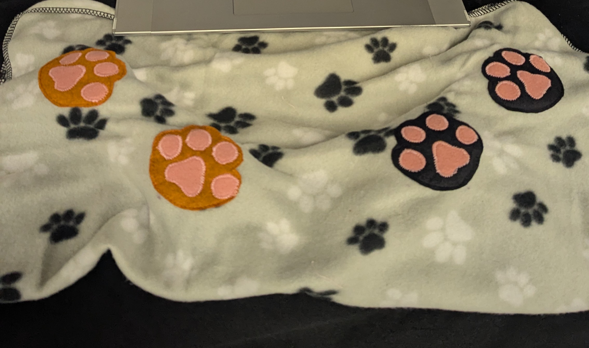
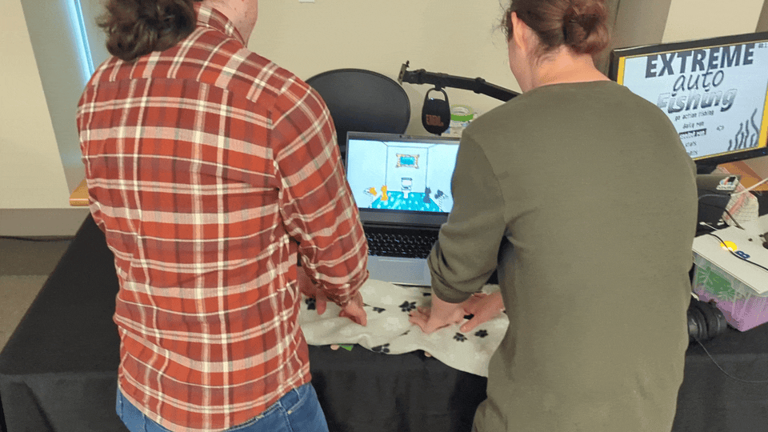

"Everyone loves watching a cat <a href="https://en.wikipedia.org/wiki/Kneading_(cats)">knead</a>" - me 
 

When I watch my cats knead I'm sooo jealous. I just want to knead too! So let's solve that problem...

Kneady cats is a game + AltCtrl controller to let you experience the joys of kneading like a cat.

Just grab a friend and place your hands upon the paws.

When you first place your hands down you'll be transported into the body of a cat. The controller provides resistance and feedback while measuring how much force you are kneading with.

Players will compete in a series of micro games to see who can knead the best. You can finally see how good you are at tasks such as: Baking bread, creating a mess, grooving to the beat, giving a message, committing road rage, and more!w 

Just look at this kneading in action...

---

At this point I bet you're asking yourself, "How can I play this!?!"

Ideally, you'll see me at MagFest in 2027 or some other gaming event. Otherwise.... you can't really play it. I am currently working on a controller version of the game (which won't be nearly as fun) and I'll eventually get up some instructions on how to build your own controller. In the mean time you can follow my progress over on [mastodon (https://mastodon.gamedev.place/@cxsquared)](https://mastodon.gamedev.place/@cxsquared). If you are running an event and want **Kneady Cats** there feel reach to reach out to me at [codylclaborn@gmail.com](mailto:codylclaborn@gmail.com).
